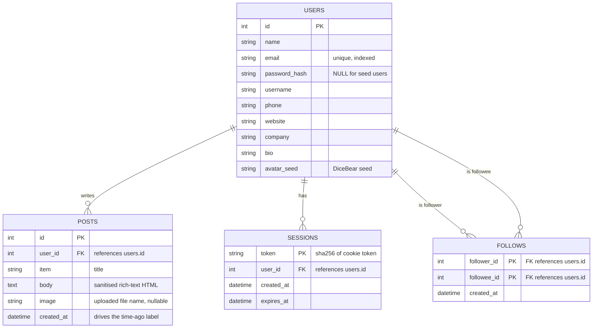

# Database Schema — Profile Explorer

The app uses **SQLite** (a relational/SQL database) via SQLAlchemy. There are
four tables: `users`, `posts`, `follows`, and `sessions`.

## Entity–Relationship Diagram

## Relationships

| Relationship | Type | Notes |
|---|---|---|
| `users` → `posts` | one-to-many | a user authors many posts; `posts.user_id` is the FK |
| `users` → `sessions` | one-to-many | each active login is one session row |
| `users` ↔ `users` (via `follows`) | many-to-many | a directed follow graph: `follower_id` follows `followee_id` |

## Notes on key columns

- **`follows`** has a **composite primary key** `(follower_id, followee_id)`,
  so a user can follow another at most once. Followers of a user = rows where
  `followee_id = :id`; people a user follows = rows where `follower_id = :id`.
- **`posts.created_at`** backs the "time ago" labels in the feed (e.g.
  "2 hours ago"). It is stored in UTC.
- **`posts.body`** holds rich-text HTML produced by the WYSIWYG editor; it is
  sanitised against a strict tag whitelist (`sanitize.py`) before being stored.
- **`posts.image`** stores only the uploaded file name; the bytes live on disk
  under `uploads/` and are served via `GET /api/uploads/<name>`.
- **`sessions.token`** stores only the **sha256** of the cookie token, never
  the raw value, so a DB leak can't resurrect a live session.
